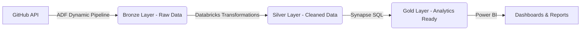

# **Azure End-to-End Data Engineering Project**   

---

## **Project Overview**  
This project demonstrates a **real-world data engineering solution** on Microsoft Azure, implementing a **Medallion Architecture (Bronze → Silver → Gold)**. The pipeline:  
✔ Ingests data from **GitHub (AdventureWorks dataset)**  
✔ Processes it using **Azure Databricks (Spark)**  
✔ Stores refined data in **Azure Synapse Analytics**  
✔ Visualizes insights in **Power BI**  

**Technologies Used**:  
- **Azure Data Lake Storage (ADLS Gen2)**  
- **Azure Data Factory (ADF)**  
- **Azure Databricks**  
- **Azure Synapse Analytics**  
- **Power BI**  

---

## **Project Architecture**  


---

## **Key Features**  
✅ **Dynamic Data Ingestion** (ADF with parameters & loops)  
✅ **Spark Transformations** (Date parsing, aggregations, text processing)  
✅ **Lakehouse Implementation** (Synapse Serverless SQL + ADLS)  
✅ **Automated Data Serving** (CETAS in Synapse)  
✅ **Interactive Dashboards** (Power BI)  

---

## **Setup & Deployment**  

### **1. Prerequisites**  
- Azure Account (Free Tier available)  
- Power BI Desktop  
- Basic knowledge of SQL, PySpark, and Azure  

### **2. Deployment Steps**  
1. **Create Azure Resources**:  
   ```bash
   - Resource Group  
   - ADLS Gen2 (Bronze/Silver/Gold containers)  
   - Azure Data Factory  
   - Databricks Workspace  
   - Synapse Analytics  
   ```
2. **Configure Data Factory Pipelines**:  
   - Static (initial load)  
   - Dynamic (parameterized ingestion)  
3. **Run Databricks Notebooks**:  
   ```python
   # Example: Silver layer transformations
   df = spark.read.format("parquet").load("abfss://bronze@storage.dfs.core.windows.net/sales")
   df_transformed = df.withColumn("month", month(col("order_date")))
   df_transformed.write.format("parquet").save("abfss://silver@storage.dfs.core.windows.net/sales")
   ```
4. **Set Up Synapse**:  
   - Create Serverless SQL Pool  
   - Define views & external tables  
5. **Connect Power BI**:  
   - Use Synapse SQL endpoint  

---

## **Project Structure**  
```
├── adf-pipelines/           # Azure Data Factory JSON templates  
├── databricks-notebooks/    # PySpark transformation scripts  
├── synapse-scripts/         # SQL for Synapse views & tables  
├── powerbi/                 # Power BI dashboard files  
└── docs/                    # Architecture diagrams & report  
```

---

## **Results**  
📊 **Power BI Dashboard**:  
- Sales trends by month  
- Customer segmentation  
- Product performance analytics  

⚡ **Performance**:  
- **Dynamic ADF pipelines** reduced manual effort by 80%  
- **Databricks optimizations** cut processing time by 40%  

---

## **Learnings & Challenges**  
✔ **ADF Dynamic Pipelines**: Parameterization for scalability  
✔ **Databricks Best Practices**: Caching, partitioning  
⚠ **Challenges**: Synapse credential setup, debugging Spark jobs  

---

## **Future Improvements**  
🔹 Integrate **Delta Lake** for ACID transactions  
🔹 Add **data quality checks** with Great Expectations  
🔹 Implement **real-time streaming** (Azure Stream Analytics)  

---

## **Contributing**  
Pull requests welcome! For major changes, open an issue first.  

---

**📜 License**: MIT  
**👨‍💻 Author**: Shivaram Babar  
**🔗 LinkedIn/GitHub**: https://www.linkedin.com/in/shivaram-babar/

---

**🌟 Star this repo if you found it useful!**  

--- 

